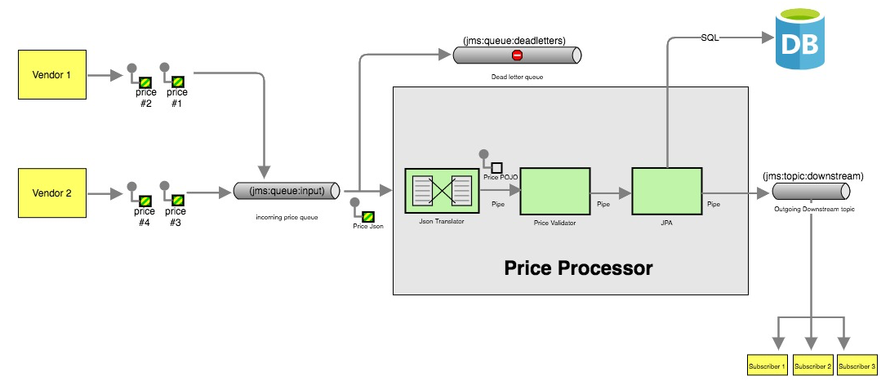
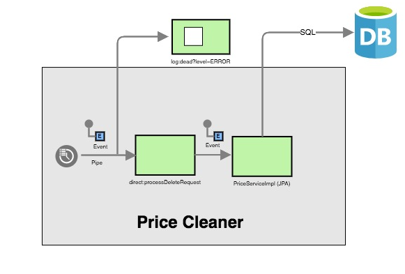
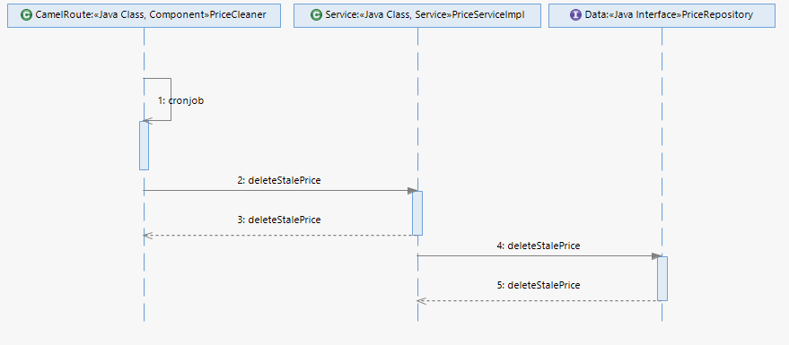
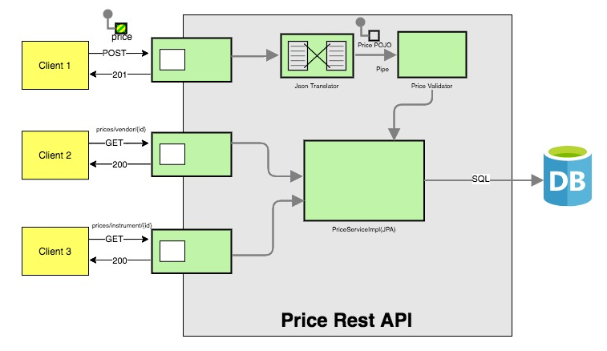
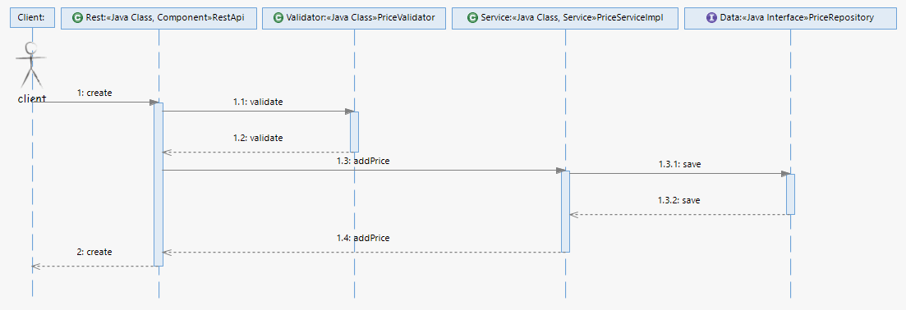
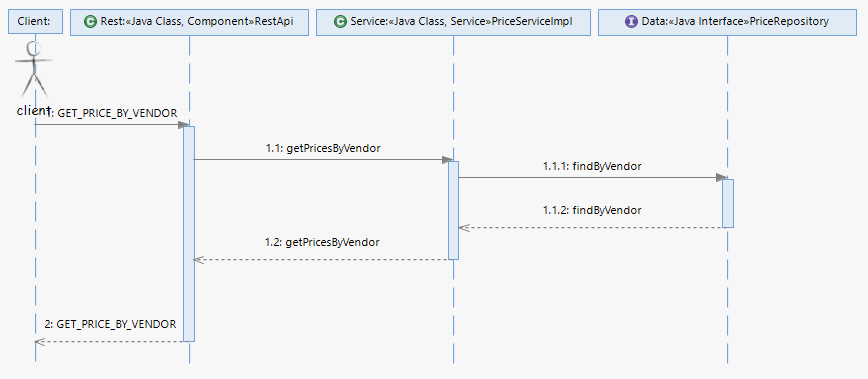
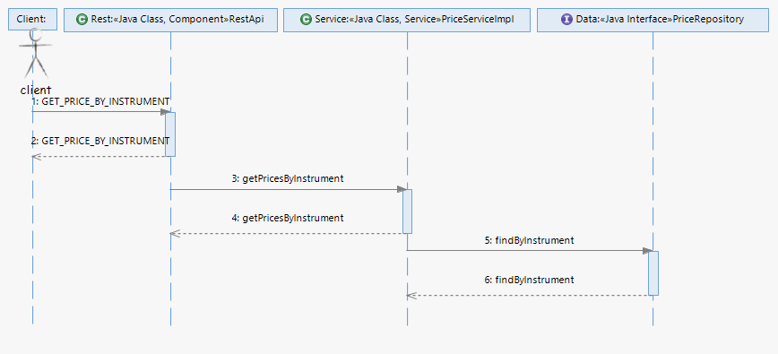
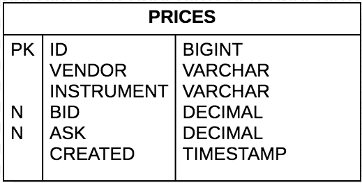
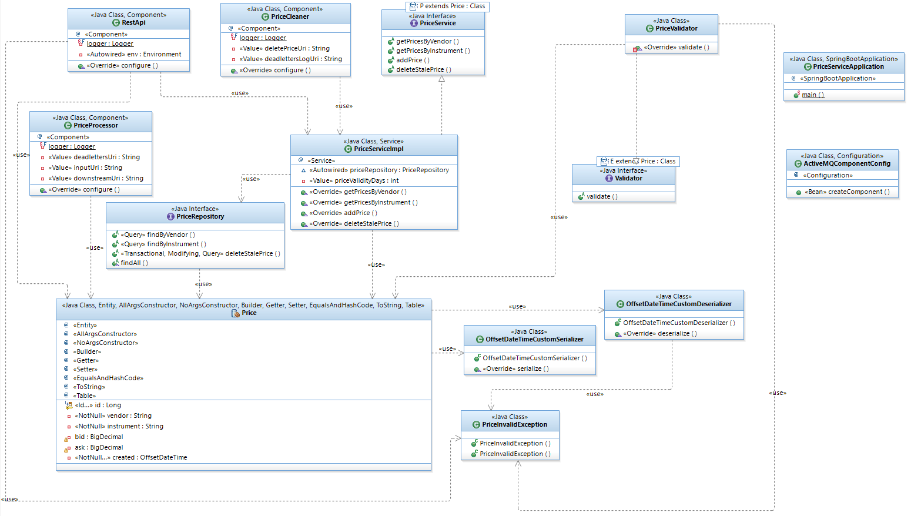

# Introduction
This application provides price information to client and downstream systems as
submitted by different vendors for traded instruments.

## Assumptions
1. Input Format : For the purposes of simplicity, i have assumed that the format received from different vendors for different instruments is homogenous.
2. Validation: I have added checks for mandatory fields. PriceValidator can be further enhanced to incorporate business needs.
3. Instrument Type: I have assumed all instrument types come in the same format and structure. A new filter/router component can be added to differentiate specific types.
4. Downstream System: For the purposes of simplicity, I am passing serialized price objects to downstream. It can be marshal to required downstream format using .marshal().json()

## High level design and Context
This application has 3 main high level components.

### 1. Price Processor



Price processor is the heart of this application. It processes the price from the vendor, stores it in db and passes it to downstream systems. It goes through a series of steps - transformation, validation, persistence and distribution. It performs validation on vendor input and redirects failed messages to dead letter queue for further processing and analysis. Dead Letter queue can be further extended to redeliver messages a couple of times before storing it in DB for manual analysis.


Following validation are done on vendor input:-

1. Price is null or empty.
2. Price does not have vendor.
3. Price does not have instrument.
4. Price does not have created date.

Following design patterns are used to implement price processor:-

1. Point to Point Channel - Queue is used to establish connection between price processor and various vendors.
2. Publish Subscribe Channel - Topics are used to publish price to interested downstream systems. New systems can subscribe at any time.
3. Dead Letter Channel - The Dead Letter Channel is used to attempt redelivery, handle poison messages and store it for future analysis.
4. Message Channel - Queue, Topic, Dead Letter queues are used.
5. Message - Message Exchange pattern inOnly is used to pass messages one way.
6. Pipes and Filters - Pipes and Filters are used to connect various components of the processor.
7. Message Translator -  Message Translator is used to convert json price messages to POJO.
8. Message Endpoints - Various message Endpoints are implemented using route URIs rather than directly using the Endpoint interface.
9. IOC - All dependencies are injected through interfaces.

### 2. Price Cleaner



Price cleaner removes old/stale price above configured threshold. Price threshold and uri of cleaner can be changed using configuration. Currently it is configured to use quartz uri which runs cron jobs once in a day at midnight. It invokes PriceSeviceImpl to execute delete commands. Any exceptions during execution of a job are logged as ERROR.

Following design patterns are used to implement price Cleaner:-

1. Event Message -  Oneway event messages are triggered using Scheduler.
2. Message Endpoints - log:dead message Endpoint is implemented using route URI.




### 3. Price Rest API



Price Rest API allows clients to publish and retrieve data from the store. Camel’s REST DSL is used to implement a RESTful API that performs required operations on a database.

Using the create API, clients can publish single price to DB. Before storing, it goes through transformation and validation. It performs following validations on client input:-

1. Price is null or empty.
2. Price does not have vendor.
3. Price does not have instrument.
4. Price does not have created date.



Using the get API, clients can get all prices from a particular vendor or prices for a single instrument from various vendors. Get API filter prices older than 30 days.





## ER Diagram

For the purposes of simplicity, I have used flat price structure but based on requirement it can be enhanced to complex structure using joins to vendor/instrument tables.



## Class Diagram



## Interfaces

### 1. Message Endpoints
This app exposes following endpoints to interface it with external services.

1. Input Endpoint: It is used by different vendors to send price information. It can be configured through the `priceservice.queue.input.uri` property. E.g. jms:queue:input
2. Dead Endpoint:  It is used to redirect all errors for further consideration and analysis. It can be configured through the `priceservice.queue.dead.uri` property. E.g. jms:queue:deadletters
3. Recursive Endpoint: It is used to execute regular tasks. It can be configured through the `priceservice.quartz.delete.uri` property. E.g. quartz://priceServiceGroup/deleteInvalidPrice?cron=0+0+0+*+*+?
4. Output Endpoint: It is used to distribute prices to interested downstream systems. It can be configured through the `priceservice.topic.downstream.uri` property. E.g. jms:topic:downstream

### 2. Rest API
The service exposes the following rest api to allow clients to publish and retrieve data from the store.

1. Create Price: To publish new price for specific vendor and instrument.
    http://localhost:8080/mizuho-price-service/prices/create
2. Get price by Vendor : To get all prices from a particular vendor.
    http://localhost:8080/mizuho-price-service/prices/vendor/:vendor
3. Get price by Vendor : To get all prices for a single instrument from various vendors.
    http://localhost:8080/mizuho-price-service/prices/instrument/:instrument

### 3. Swagger API
The app provides API documentation of the services using Swagger using the _context-path_ `+mizuho-price-service/api-doc+`.
You can access the API documentation from your Web browser at
    http://localhost:8080/mizuho-price-service/api-doc

## Running the Project / Demo

### Prerequisite

* maven 3.3.x
* java 1.8+

### Build

You can build this application using:

```bash
 mvn package
```

### Run

You can run this application with Maven using:

```bash
 mvn spring-boot:run -Dspring-boot.run.profiles=dev
```

Alternatively, you can also run this application using the executable JAR:

```bash
 java -jar -Dspring.profiles.active=dev target/price-service-0.0.1-SNAPSHOT.jar
```
It will start the embedded tomcat server on default port 8080. It uses an embedded in-memory H2 database. You can use the default
Spring Boot profile in case you have a MySQL server available for you to test.

When the Camel application runs, you should see the following messages being logged to the console, e.g.:

```bash
INFO 14561 --- [main] o.a.activemq.broker.TransportConnector:Connector vm://embedded started
INFO 14561 --- [main] o.a.c.i.e.InternalRouteStartupManager:Route: vendor-price started and consuming from: jms://queue:input
INFO 14561 --- [main] o.a.c.i.e.InternalRouteStartupManager:Route: doc-api started and consuming from: servlet:/api-doc
INFO 14561 --- [main] o.a.c.i.e.InternalRouteStartupManager:Route: prices-vendor-api started and consuming from: servlet:/prices/vendor/%7Bid%7D
INFO 14561 --- [main] o.a.c.i.e.InternalRouteStartupManager:Route: prices-instrument-api started and consuming from: servlet:/prices/instrument/%7Bid%7D
INFO 14561 --- [main] o.a.c.i.e.InternalRouteStartupManager:Route: prices-create-api started and consuming from: servlet:/prices/create
INFO 14561 --- [main] o.a.c.impl.engine.AbstractCamelContext:Total 7 routes, of which 7 are started
INFO 14561 --- [main] o.a.c.impl.engine.AbstractCamelContext:Apache Camel 3.8.0-SNAPSHOT (MizuhoPriceService) started in 437ms
INFO 14561 --- [main] o.a.c.component.quartz.QuartzComponent:Starting scheduler.
INFO 14561 --- [main] org.quartz.core.QuartzScheduler:Scheduler DefaultQuartzScheduler-MizuhoPriceService_$_NON_CLUSTERED started.
INFO 14561 --- [main] c.mizuho.price.PriceServiceApplication:Started PriceServiceApplication in 5.207 seconds (JVM running for 5.667)
```

The Camel application can be stopped pressing ctrl+c in the shell.

# How to Use
1] Client Functionality

 a. To publish price : POST request http://localhost:8080/mizuho-price-service/prices/create with

 Input :
 ```json
    {
	"vendor" : "Bloomberg",
	"instrument" : "DE000JPM85H5",
	"bid" :  80.63,
	"ask" : 66.27,
	"created" : "2020-12-29T12:11:22z"
    }
 ```
 Output: 201 Created
  ```json
   { "message": "Successfully created price" }
 ```
 b. To get price by vendor : GET request http://localhost:8080/mizuho-price-service/prices/vendor/Bloomberg

 Output : 200 OK
 ```json
    [
        {
            "id": 1,
            "vendor": "Bloomberg",
            "instrument": "DE000JPM85H5",
            "bid": 80.63,
            "ask": 66.27,
            "created": "2020-12-29T12:11:22Z"
        }
    ]
 ```
 c. To get price by instrument : GET request http://localhost:8080/mizuho-price-service/prices/instrument/DE000JPM85H5/

 Output : 200 OK
 ```json
    [
        {
            "id": 1,
            "vendor": "Bloomberg",
            "instrument": "DE000JPM85H5",
            "bid": 80.63,
            "ask": 66.27,
            "created": "2020-12-29T12:11:22Z"
        }
    ]
 ```

2] Vendor Functionality

 a. To send price, use queue jms:queue:input

3] Downstream Functionality

a. To receive price, subscribe to topic jms:topic:downstream

4] Swagger API : GET request http://localhost:8080/mizuho-price-service/api-doc

 Output : 200 OK
 ```json
{
  "swagger" : "2.0",
  "info" : {
    "version" : "1.0",
    "title" : "Mizuho Price Service API"
  },
  "host" : "localhost:8080",
  "basePath" : "/mizuho-price-service",
  "tags" : [ {
    "name" : "prices",
    "description" : "Prices REST service"
  } ],
  "schemes" : [ "http" ],
  "paths" : {
    "/prices/create" : {
      "post" : {
        "tags" : [ "prices" ],
        "summary" : "Creates a new price",
        "operationId" : "verb3",
        "consumes" : [ "application/json" ],
        "produces" : [ "application/json" ],
        "parameters" : [ {
          "in" : "body",
          "name" : "body",
          "required" : true,
          "schema" : {
            "$ref" : "#/definitions/Price"
          }
        } ],
        "responses" : {
          "200" : { }
        }
      }
    },
    "/prices/instrument/{id}" : {
      "get" : {
        "tags" : [ "prices" ],
        "summary" : "Prices by instrument id",
        "operationId" : "verb2",
        "parameters" : [ {
          "name" : "id",
          "in" : "path",
          "required" : true,
          "type" : "string"
        } ],
        "responses" : {
          "200" : { }
        }
      }
    },
    "/prices/vendor/{id}" : {
      "get" : {
        "tags" : [ "prices" ],
        "summary" : "Prices by vendor id",
        "operationId" : "verb1",
        "parameters" : [ {
          "name" : "id",
          "in" : "path",
          "required" : true,
          "type" : "string"
        } ],
        "responses" : {
          "200" : { }
        }
      }
    }
  },
  "definitions" : {
    "Price" : {
      "type" : "object",
      "required" : [ "created", "instrument", "vendor" ],
      "properties" : {
        "id" : {
          "type" : "integer",
          "format" : "int64"
        },
        "vendor" : {
          "type" : "string"
        },
        "instrument" : {
          "type" : "string"
        },
        "bid" : {
          "type" : "number"
        },
        "ask" : {
          "type" : "number"
        },
        "created" : {
          "type" : "string",
          "format" : "date-time"
        }
      }
    }
  }
}
 ```
### Technologies used
- Java 8
- Maven
- Spring Boot
- Apache Camel
- Camel’s REST DSL
- JPA
- Spring Data
- lombok
- jackson
- Quartz
- Embedded Tomcat Server
- Activemq
- Mysql
- Embedded Tomcat Server
- Embedded broker
- JMS
- Hsqldb
- junit5
- CamelSpringBootTest
- slf4j
- TDD
- StarUML
